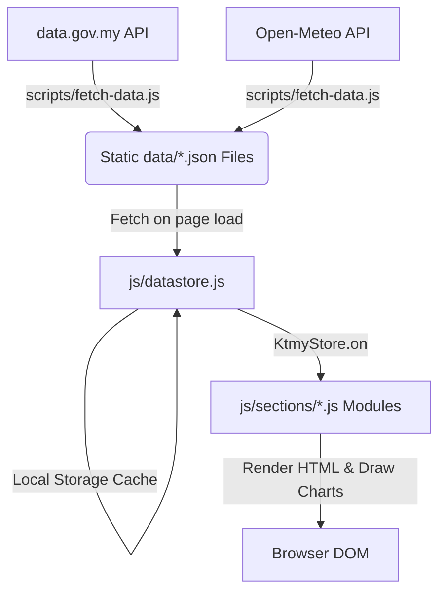

# KTMY — Malaysia's All-in-One Data Dashboard

KTMY is a premium, high-fidelity, real-time open data dashboard for Malaysia. It aggregates meteorological, economic, financial, demographic, social, and transit indicators into a responsive, unified tabbed interface.

---

## 🏗️ Architecture & Data Flow

KTMY is built with a **Static-First, Server-Side Aggregation** model. It separates data retrieval from frontend rendering to maximize speed, eliminate API rate limits, and ensure 100% availability.



### 1. The Data Bot (`scripts/fetch-data.js`)
*   **Role**: Runs server-side (via GitHub Actions cron or local schedule) every 2 hours.
*   **Function**: Pulls raw endpoints from `data.gov.my` and `Open-Meteo`, formats them, adds metadata (timestamp and source), and saves them directly to `data/*.json` files.
*   **Rate Limits**: Respects the official API rate limit (max 4 requests per minute) by incorporating a sequential 16-second delay between requests.

### 2. The DataStore (`js/datastore.js`)
*   **Role**: The frontend state manager.
*   **Caching Strategy**: On page load, it fetches the static `/data/*.json` files. It saves successful queries to `localStorage` (prefix: `ktmy_v7_`).
*   **Fallbacks**: If a static file is missing or corrupted, it automatically attempts a direct fallback fetch to the live `data.gov.my` API as a last resort.

### 3. Cache-Busting Mechanism
*   **Script Cache-Busting**: Browsers heavily cache static Javascript files. To force immediate updates, all scripts in `index.html` include a versioned query parameter (e.g., `js/sections/economy.js?v=7`).
*   **Local Storage Invalidation**: Bumping the `STORE_VERSION = 'v7'` in `datastore.js` changes the `localStorage` prefix to `ktmy_v7_`, instantly evicting stale cached objects across all client browsers.

---

## 📊 Data Authenticity & Source Ledger

To maintain high performance, rate-limit safety, and verified listings, KTMY categorizes data flows into **API-Driven Datasets** (regularly updated via the automated fetch bot) and **Hand-Curated / Cross-Checked Directories** (maintained statically due to raw format constraints or lack of government JSON APIs).

### 1. API-Driven Datasets (Fully Automated)
These datasets are fetched directly from the official Malaysian Open Data portal (`api.data.gov.my`) and `Open-Meteo` by `scripts/fetch-data.js`:
*   **Fuel Prices**: Raw daily fuel rates for RON95, RON97, and Diesel.
*   **Exchange Rates**: Daily currency valuations relative to MYR.
*   **GDP & Inflation**: Quarterly absolute/YoY GDP growth metrics and monthly Headline CPI.
*   **Unemployment**: Monthly labor force and jobless rate indices.
*   **External Trade**: Monthly import/export indices.
*   **Transit Ridership**: Daily public transit passenger boarding volumes.
*   **Tourism Arrivals**: Monthly visitor entries by country (exhibits standard DOSM publishing lag; supplemented with curated 2025/2026 figures).
*   **Weather & Warning Feeds**: Live 7-day forecast data and active disaster alerts (flood/seismic warnings).
*   **Healthcare (Dengue)**: Weekly dengue cases and deaths by state.

### 2. Hand-Curated & Scraped Directories (Verified References)
These datasets cannot be parsed reliably from live APIs due to lack of JSON endpoints or overly large unstructured streams. They are cross-checked against official resources and saved in `data/`:
*   **Latest Tourism Arrivals (2025/2026)** (supplemented inside `data/tourism.json`): Pre-loaded with official total arrivals for all months of 2025 and Q1 2026 sourced directly from Tourism Malaysia reports.
*   **TNB Electricity Tariffs** (`data/tnb_tariffs.json`): Manually scraped from the Tenaga Nasional Berhad official tariff guide and cross-checked.
*   **Government Incentives Directory** (`data/incentives.json`): Curated directly from LHDN, BSH, EPF, and MOF official announcement sheets.
*   **Transport Fares** (`data/transport_fares.json`): Extracted from RapidKL, KTM Komuter, ETS, ERL, and Grab official fare matrices.
*   **Consumer Prices / Groceries** (`data/prices.json`): Extracted from KPDN's PriceCatcher database representing retail averages in key supermarkets (Mydin, Lotus, Econsave).
*   **Education Stats** (`js/sections/education.js`): Compiled from MOE's annual "Malaysia Education Quick Facts" publications.

---

## 📂 Project Structure

```
├── data/                    # Pre-fetched static JSON datasets
│   ├── fuel.json            # Fuel prices
│   ├── exchange.json        # Exchange rates
│   ├── gdp.json             # GDP quarterly
│   ├── inflation.json       # CPI / Inflation
│   ├── unemployment.json    # Unemployment
│   ├── trade.json           # Trade monthly
│   ├── tourism.json         # Tourism arrivals
│   ├── transport.json       # Transit ridership
│   ├── population.json      # Population data
│   ├── weather_forecast.json
│   ├── weather_warnings.json
│   ├── earthquake.json
│   ├── flood_warnings.json
│   ├── openmeteo_all.json   # Open-Meteo weather for 16 cities
│   ├── tnb_tariffs.json     # TNB electricity tariffs (v1.2, curated)
│   ├── incentives.json      # Government incentives directory (v1.2, curated)
│   ├── transport_fares.json # Transport fare reference (v1.2, curated)
│   └── manifest.json        # Fetch metadata
├── css/                     # Styling sheet hierarchy
│   ├── index.css            # Base styles, variables, typography, and theme tokens
│   ├── components.css       # Cards, tables, loaders, alerts, and navigation styles
│   └── responsive.css       # Mobile and tablet layouts
├── js/                      # Frontend Logic
│   ├── sections/            # Tab-specific UI renderers
│   │   ├── hero.js          # Overview page
│   │   ├── weather.js       # Live weather mapping and forecasts
│   │   ├── economy.js       # GDP, CPI, and external trade charts
│   │   ├── population.js    # Demographics and growth trend
│   │   ├── employment.js    # Labour force and unemployment
│   │   ├── transport.js     # Public transit aggregation
│   │   ├── tariffs.js       # TNB electricity tariffs (v1.2)
│   │   ├── government.js    # Government incentives & support directory (v1.2)
│   │   └── ...              # Other sectors (fuel, prices, safety, etc.)
│   ├── api.js               # API fetch helper utility
│   ├── datastore.js         # Unified datastore manager
│   ├── i18n.js              # Localization (English and Bahasa Malaysia translations)
│   ├── charts.js            # Wrapper functions around Chart.js
│   ├── animations.js        # Scroll reveal and UI micro-animations
│   └── app.js               # Global router and navigation handler
├── scripts/                 # Server-side scripts
│   └── fetch-data.js        # Node.js data collector cron bot
├── index.html               # Main dashboard shell
└── package.json             # Dev server config & script definitions
```

---

## What's New in v2.0 (Rebrand & Core Updates)

*   **Platform Rebranding (KTMY)** — Fully rebranded the application from NADI to KTMY (Key to Malaysia) across all code namespaces, local storage keys, configurations, stylesheets, and documentation.
*   **One-Time Terms & Disclaimer Popup** — Integrated a premium glassmorphic overlay modal that pops up on first load to inform users about the alpha/beta stage, data aggregation from official government APIs (data.gov.my, DOSM, MOH), and liability terms. The accepted state is stored in `localStorage` to prevent reappearance.
*   **Refined Safety Alerts** — Monitored stations showing a normal water level are filtered out from flood warnings, and seismic records are restricted to the last 30 days, showing a clean "All Clear" fallback when no warnings exist.
*   **Dynamic Government Incentives Directory** — Curated links, eligibility rules, and descriptions for education financing (PTPTN, JPA, MARA) and business grants (SME matching, TERAJU, TEKUN) are mapped dynamically from `data/incentives.json`.
*   **Transit Pricing Reference** — Added curated pricing structures for RapidKL, KLIA Ekspres, Grab (e-hailing), KTM Komuter, and ETS routes in the Society & Transit section.

See `CHANGES-v1.2.md` for historical release details.

---

## 🔀 Section Module Integration

Each module in `js/sections/` implements a standard lifecycle:
1.  **Registering**: Appends itself to the global `window.KtmySections` namespace.
2.  **Initializing (`init`)**: Sets up DOM containers and subscribes to data keys in `KtmyStore`.
3.  **Rendering (`renderSection`)**: Sorts, filters, scales metrics, inserts layouts, and calls `KtmyCharts` wrappers to draw canvas charts.
4.  **Localizing (`translate`)**: Re-renders text and formats numbers when language toggles are clicked.

### Example: Economy Section (`js/sections/economy.js`)
*   **Data Key**: Subscribes to `gdp`, `inflation`, and `trade`.
*   **Parsing Details**:
    *   Filters raw `gdp` to `series === 'abs'` for absolute quarterly values.
    *   Extracts `growth_yoy` directly from the raw DOSM YoY series.
    *   Filters raw `inflation` to `division === 'overall'` to display headline CPI.

### Example: Public Transport Section (`js/sections/transport.js`)
*   **Data Key**: Subscribes to `transport`.
*   **Aggregation**: Merges 365 daily logs into monthly groups. It sums the 10 rail subsystems (`rail_ets`, `rail_lrt_kj`, `rail_mrt_pjy`, etc.) and 3 bus networks (`bus_rkl`, `bus_rkn`, `bus_rpn`) to show overall monthly boardings in Millions.

---

## 🌐 Localization (i18n)

*   `js/i18n.js` contains a comprehensive lookup dictionary for English (`en`) and Bahasa Malaysia (`bm`).
*   Translate static HTML elements using the `data-i18n="key"` attribute.
*   Translate dynamic elements inside scripts by calling `KtmyI18n.t('key')` or `KtmyI18n.getLang()`.

---

## 🚀 Running Locally

### Prerequisites
*   Node.js (version 18 or higher)

### Setup & Run
1.  Clone the repository:
    ```bash
    git clone https://github.com/kamalcr7/KTMY.git
    cd KTMY
    ```
2.  Install development dependencies (uses `http-server` locally):
    ```bash
    npm install
    ```
3.  Refresh static data locally (optional):
    ```bash
    npm run fetch-data
    ```
4.  Start the development server:
    ```bash
    npm run dev
    ```
    Open **http://127.0.0.1:3500** in your browser.

---

## 💡 Developer Guidelines for Agents & Collaborators

When modifying KTMY, preserve these core design guidelines:
1.  **Keep it Static-First**: Do not introduce direct live API fetches in the frontend code. If you add a new API feature, add it to `scripts/fetch-data.js` first, save it to `data/`, and fetch it via `KtmyStore.on()`.
2.  **Filter Dimension Datasets**: Catalogue datasets from `data.gov.my` often merge absolute values, QoQ, YoY, and individual divisions. Always filter records (e.g. `series === 'abs'`, `division === 'overall'`) before drawing charts to avoid oscillation bugs.
3.  **Scale Correctly**: Be mindful of units. The raw APIs report some statistics in absolute figures, some in thousands, and some in millions. Document the scaling conversions in your modules.
4.  **Bust the Cache**: If you change any dynamic logic in a script file, bump the version query parameter in `index.html` (e.g., change `?v=7` to `?v=8`) and the `STORE_VERSION` in `datastore.js`.
